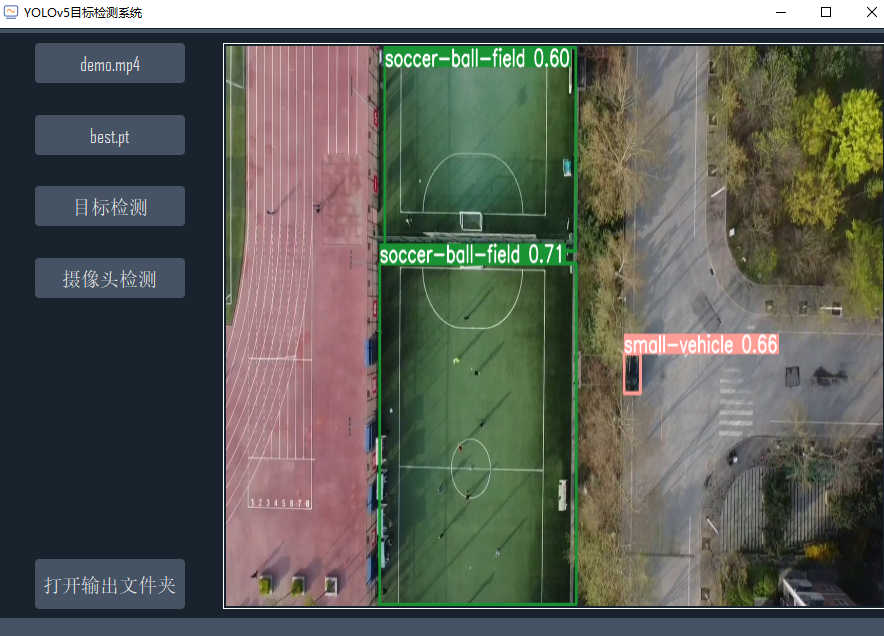

## yolov5_pyqt5

这是一个使用pyqt5搭建YOLOv5目标检测可视化程序。

项目采用了极简设计，以便读者可以基于此界面进行二次开发。

目前支持：
- 图像检测
- 视频检测
- 摄像头检测

项目界面：



项目内置了测试数据，下载之后可直接运行

# 使用方式
1.安装Cuda、Cudnn

根据自己设备GPU型号选择合适版本进行安装

2.安装torch、torchvision

- torch版本：1.7.1
- torchvision版本：0.8.2

在[此处](https://download.pytorch.org/whl/torch_stable.html)根据Cuda版本选择合适的文件下载安装

3.安装剩余模块其它依赖

```
pip install -r requriements.txt
```

4.运行main.py即可看到显示界面


# 打包版本
应某些读者的需求，打了个包，有需要的可自行下载(仅支持windows)：[百度云盘](https://pan.baidu.com/s/1egD-K_lDKQn-RdnhIk_iXg?pwd=8888)


## Contact

本项目不会再添加新功能，如果你发现bug，欢迎在issue中提出，我会及时修复

如果你需要其它定制功能，可以联系我的微信：zstar1003
 
 
## Star History

如果此项目对你有所帮助，请给项目点个star


