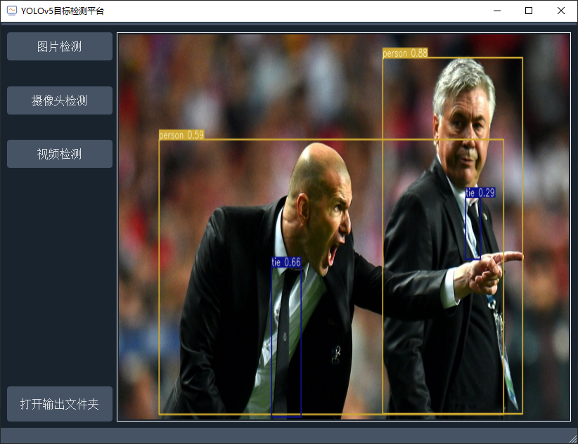

## yolov5_pyqt5

这是一个使用pyqt5搭建YOLOv5目标检测可视化程序。

项目采用了极简设计，以便读者可以基于此界面进行二次开发。

主要功能：加载单图/选择模型/目标检测

YOLOv5版本为最新版本(6.0+)，5.0版本可查看[Tags](https://github.com/zstar1003/yolov5_pyqt5/tree/yolov5-5.0)

项目界面：

# 使用方式
在使用本项目之前，建议先配置好最新版本的YOLOv5的环境并跑通

之后在相同环境中安装pyqt5、qdarkstyle等依赖

最后运行main.py即可看到显示界面
 
## Stars over time

如果此项目对你有所帮助，请给项目点个star

如果有任何问题，均可在此仓库中提出issue

